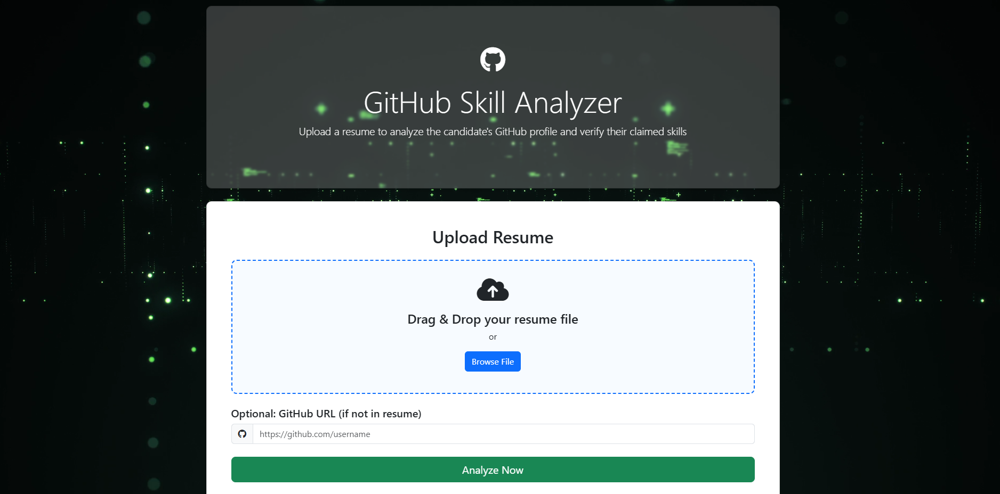
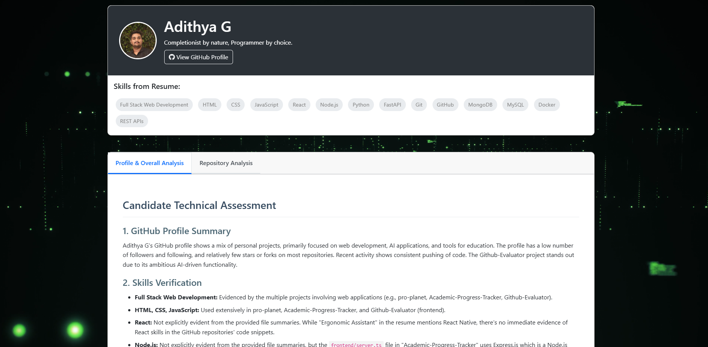

# GitHub Skill Analyzer

A Flask web application that analyzes technical resumes, extracts GitHub profiles, and provides comprehensive insights by comparing resume claims with actual GitHub activity and repositories.

## Features

- **Resume Upload & Analysis**
  - Supports PDF and text files
  - Automatically extracts GitHub profile URL
  - Extracts skills mentioned in the resume

- **GitHub Profile Analysis**
  - Verifies skills claimed in resume
  - Analyzes public repositories
  - Examines coding activity and contributions

- **Repository Analysis**
  - Assesses code quality
  - Identifies technical skills demonstrated in code
  - Suggests interview questions based on repositories

- **Cross-Reference & Validation**
  - Matches resume claims with GitHub evidence
  - Identifies skills shown on GitHub but not mentioned in resume
  - Evaluates overall consistency between resume and GitHub profile

## Project Structure

```
github-resume-analyzer/
├── .env                  # Environment variables (create this)
├── app.py                # Main application file
├── requirements.txt      # Dependencies
├── uploads/              # Directory for uploaded resumes (created automatically)
└── templates/            # HTML templates
    ├── index.html
    ├── manual_github.html
    ├── result.html
    └── repo_analysis.html
```

## Prerequisites

- Python 3.7+
- GitHub Personal Access Token (optional but recommended)
- Google Gemini API Key

## Installation

1. **Clone the repository**
   ```bash
   git clone https://github.com/yourusername/github-resume-analyzer.git
   cd github-resume-analyzer
   ```

2. **Create a virtual environment**
   ```bash
   python -m venv venv
   source venv/bin/activate  # On Windows: venv\Scripts\activate
   ```

3. **Install dependencies**
   ```bash
   pip install -r requirements.txt
   ```

4. **Create environment variables file**
   Create a file named `.env` in the project root with the following content:
   ```
   # GitHub Personal Access Token (Optional but recommended to avoid rate limits)
   # Create one at: https://github.com/settings/tokens
   GITHUB_TOKEN=your_github_token_here
   
   # Google Gemini API Key
   # Get one at: https://makersuite.google.com/app/apikey
   GEMINI_API_KEY=your_gemini_api_key_here
   ```

5. **Create requirements.txt file**
   ```
   flask==2.3.3
   requests==2.31.0
   python-dotenv==1.0.0
   google-generativeai==0.7.1
   PyMuPDF==1.23.7  # For PDF extraction
   Werkzeug==2.3.7
   ```

## Running the Application

1. **Start the Flask server**
   ```bash
   python app.py
   ```

2. **Access the application**
   Open your browser and navigate to `http://127.0.0.1:5000/`

## Usage Guide

1. Upload a candidate's resume (PDF or text file)
2. The system will automatically extract the GitHub profile URL
3. If no GitHub URL is found, you'll be prompted to enter it manually
4. The application will analyze the GitHub profile and generate a comprehensive report
5. The report will include an assessment of the candidate's coding skills, activity, and consistency with their resume

## Tips for Best Results

- Use PDFs with proper text extraction (not scanned images)
- Ensure the resume contains a valid GitHub URL (typically in the contact/links section)
- Use a GitHub token to avoid API rate limits when analyzing multiple candidates

## Contributing

Contributions are welcome! Please feel free to submit a Pull Request.

1. Fork the repository
2. Create your feature branch (`git checkout -b feature/amazing-feature`)
3. Commit your changes (`git commit -m 'Add some amazing feature'`)
4. Push to the branch (`git push origin feature/amazing-feature`)
5. Open a Pull Request
## Images


## License

This project is licensed under the MIT License - see the LICENSE file for details.

## Acknowledgments

- [Google Gemini API](https://ai.google.dev/) for AI-powered analysis
- [GitHub API](https://docs.github.com/en/rest) for repository data extraction
